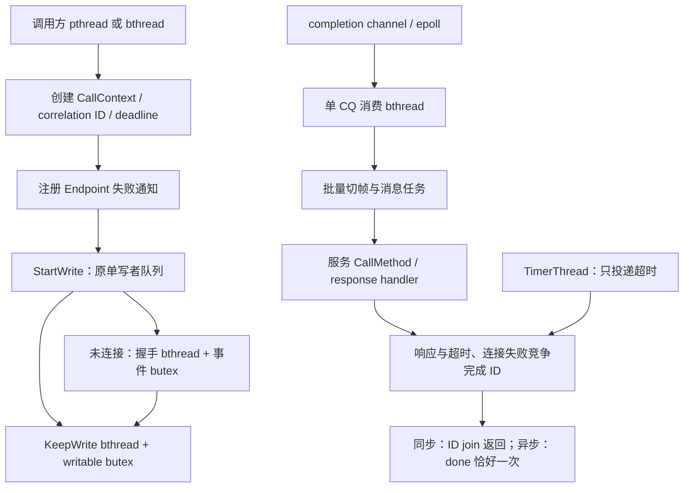

# 将 bthread 基础设施接入 RPC 流程的修改方案

日期：2026-10-06。状态：方案阶段，尚未实施本文的运行时代码修改。

## 1. 结论与范围

以 brpc 的事件消费、消息分发、发送队列、调用完成和连接生命周期为骨架，复用已经移植的 bthread。迁移的核心是把 RPC 的等待与完成协议接入调度器，而不只是替换 `std::thread`。

本轮方案覆盖客户端调用、按需建连及握手、发送队列、事件驱动 CQ、服务执行、响应、超时、连接失败和关闭回收。继续采用单连接长连接模型；不引入短连接、连接池、SocketMap、RDMA polling 模式。双 QP 大消息路径属于本项目扩展，需要单独证明与 RPC 完成协议的组合正确性。

默认直接复用原版算法、原子操作和内存序。下文明确标注有意保留的项目差异与需要补齐的依赖，不能把“简化”作为改写并发协议的理由。

## 2. 分析基线与源码依据

- light-rpc：HEAD `2702dd5cec0742a3fd6400af5629874ddc4aecc5`，**分析包含当前工作区尚未提交的移植及修复**，不等同于该提交的干净快照。
- brpc：本机 `/home/syt/Desktop/brpc/brpc`，HEAD `d688e7550be4b4c41b9a4dc55add2a2c75be1296`。
- 当前基础设施以 [bthread 移植审计](../../knowledge/bthread-port-audit-2026-10-06.md) 与实际源码为准；[早期移植设计](bthread-port-design.md) 仅作历史参考。
- 继续遵守 [AGENTS.md](../../../AGENTS.md)、[CLAUDE.md](../../../CLAUDE.md) 和 [Endpoint 并发修复记录](../problem-fix/rdma-endpoint-concurrency.md)。

| 流程 | light-rpc 当前入口 | brpc 对照位置（上述提交） | 决策 |
|---|---|---|---|
| 调用发起与等待 | `FastChannel::CallMethod` | `src/brpc/channel.cpp: Channel::CallMethod`；`controller.cpp: Join / HandleTimeout / EndRPC` | 引入最小调用上下文与 Controller，用 ID 完成调用 |
| 连接失败广播 | `FastChannel::OnEndpointFailed`、`pending_` | `socket.cpp: NotifyOnFailed / OnFailed` | 复用 `bthread_id_list`，不另造等待者队列 |
| epoll 分发 | `EventDispatcher::RunEpollLoop` | `event_dispatcher_epoll.cpp: Start / Run`；`socket.cpp: OnInputEvent` | 移植启动属性、事件回调与消费任务边界 |
| 握手读写 | `ReadFromFd / WriteToFd / On*Handshake` | `rdma/rdma_endpoint.cpp: OnNewDataFromTcp / ReadFromFd / WriteToFd`；`socket.cpp: WaitEpollOut` | 补齐事件驱动 butex 等待，再迁移握手任务 |
| 单写者发送 | `StartWrite / StartKeepWrite / KeepWrite` | `socket.cpp: StartWrite / KeepWrite / IsWriteComplete` | 保持队列算法，迁移后台执行载体 |
| CQ 消费 | `OnCompChannelEvent / PollCq` | `socket.cpp: OnInputEvent`；`rdma/rdma_endpoint.cpp: PollCq` | 保持单消费者及 arm/re-poll 协议 |
| 消息与用户代码 | `MessageDispatcher::ProcessNewMessage` | `input_messenger.cpp: QueueMessage / InputMessageClosure / ProcessNewMessage` | 批量创建任务、flush、最后消息执行协议 |
| 服务完成 | `FastServer::OnProcessRequest / ReturnRPCResponse` | `policy/baidu_rpc_protocol.cpp` 的请求处理与响应闭包 | 保持 protobuf 异步 done 与对象所有权 |
| 失败后恢复 | Channel 固定 Endpoint，错误状态不恢复 | `details/health_check.cpp: HealthCheckTask`；`socket.cpp: WaitAndReset / CheckHealth` | 最小移植恢复协议，不把永久失败视为单连接终态 |

源码链接示例：[brpc Channel](https://github.com/apache/brpc/blob/d688e7550be4b4c41b9a4dc55add2a2c75be1296/src/brpc/channel.cpp)、[InputMessenger](https://github.com/apache/brpc/blob/d688e7550be4b4c41b9a4dc55add2a2c75be1296/src/brpc/input_messenger.cpp)、[RDMA Endpoint](https://github.com/apache/brpc/blob/d688e7550be4b4c41b9a4dc55add2a2c75be1296/src/brpc/rdma/rdma_endpoint.cpp)、[连接恢复](https://github.com/apache/brpc/blob/d688e7550be4b4c41b9a4dc55add2a2c75be1296/src/brpc/details/health_check.cpp)。

## 3. 当前尚未贯通的部分

已落地的调度器、butex、mutex/condition_variable、TimerThread、bthread_id、ID list、ResourcePool、object_pool、VersionedRefWithId 足够支撑主要流程。`fastrpc` 已链接 `fast_bthread`；Endpoint 可写等待已经使用 butex，Endpoint 与事件注册已经采用版本化引用。

目前可从代码直接确认：

1. 每个完整消息创建 detached `std::thread`；握手、KeepWrite 和 CQ 消费也通过独立线程执行。
2. `CallMethod` 忽略 `done`，在栈上创建 `PendingRequest`，用 `std::condition_variable` 同步等待；一分钟超时在排队、大消息窗口等待之后才开始计算。
3. 附件保存在共享 Channel 上，不具备并发调用的逐请求隔离；服务端把空 Controller 交给业务。
4. 握手 socket 已设非阻塞，但 EAGAIN 后调用 `usleep(1000)`；握手回调启动后取消 TCP 事件注册。只换成普通 bthread 会继续阻塞 worker，并失去事件驱动等待的基础。
5. Endpoint 失败后，Channel 的 `connection_error_` 和固定 EndpointId 使后续调用持续失败；现有实现不能作为最终长连接恢复模型。
6. 大消息容量、回收等待仍使用 pthread 条件变量；handler 返回值在 detached 消息线程中被忽略。

此外存在两个需在接入前定向验证的代码问题，**本轮没有运行复现，不标为已复现故障**：客户端正常响应解析计算了 payload 长度，却把包含 attachment 的余下 frame 交给 protobuf；大消息接收端在发出 Authority 后才登记 `pending_large_map_`，存在对端快速写回而本地尚未登记的时序窗口。它们应独立修复和验收，避免混入调度性能结论。

`src-resource/fast_shared.cc` 的旧线程池仍参与编译，但在已检查的 `FastChannel → FastRdmaEndpoint → FastServer` 主链中没有使用；不据此改造另一套资源架构。实施前再核对外部使用方。

## 4. 目标流程与执行上下文

图中不表示一次 CQE 就完成一次 RPC。传输完成、消息处理完成、用户 RPC 完成是三个不同事件。

### 4.1 EventDispatcher、CQ 与消息任务

- 对照 brpc `EventDispatcher::Start` 移植其 `BTHREAD_ATTR_NORMAL | BTHREAD_NEVER_QUIT | BTHREAD_GLOBAL_PRIORITY` 启动及停止/join 顺序，核对当前调度器相关分支。**该版本 brpc 的 epoll 循环本身仍调用阻塞 `epoll_wait`，不是由 bthread 自动异步化，也不是默认 PTHREAD 属性。**它会占用执行它的 worker，性能对比时须计算此成本，不承诺所有 worker 均可用于业务。
- 不顺带增加多 tag、多 dispatcher 池；先使用单 dispatcher。初始化 scheduler 后启动 dispatcher，进程退出时先停 dispatcher/所有生产任务，再停止 scheduler。单个 Channel/Server 关闭不调用全局 `bthread_stop_world`。
- CQ 入口保留 `AddReadEvent / MoreReadEvents` 的 `_nevent` 协议与原内存序；只有取得消费权的任务访问 CQ/read buffer。参考 `Socket::OnInputEvent` 选择 urgent 启动路径，不能仅凭“看起来更公平”换调度顺序。
- 保留 4 个 CQ 的项目扩展和现有消费顺序，不引入 `polling_cq`。新事件在退出 CAS 前后到达的接力关系必须保持；归还消费权后不得继续访问由该权保护的 CQ 状态。
- 消息上下文携带 `IOBuf`、handler、Endpoint 引用，优先使用已有 object_pool。参照 `QueueMessage` 使用 `BTHREAD_NOSIGNAL` 成批入队并保证 flush，参照 `InputMessageClosure` 将最后一条消息延后到 CQ 消费任务退出阶段执行。
- **最后消息的持有者必须放在完整 CQ 消费作用域**。不能在每次切帧函数返回时立即调用业务，否则同步业务等待同连接响应时，仍被占用的 CQ 消费权会阻止后续响应处理。逐批处理与创建任务失败时原版 inline fallback 的行为须逐项对照；不能凭空保证任意阻塞业务在该失败路径仍能前进。
- 服务业务默认普通 bthread；不承诺自动 hook 用户的阻塞 syscall。与 brpc 一样，业务需要使用可协作的等待接口；本轮不扩展用户代码备份线程池。
- `MessageHandler` 返回协议需明确：连接级帧损坏使 Endpoint 失败，业务级错误返回 RPC 错误响应。不能继续丢弃返回值，也不能把所有业务错误升级为连接错误。

任务启动前转移堆上下文所有权；子任务可能在 `bthread_start_*` 返回前执行完。成功后启动方不再碰上下文；失败时启动方恢复所有权并执行对应清理。启动 API 返回的错误码不能错误地用 `errno` 代替。参考原版 fallback，分别验证消息、CQ、握手、KeepWrite 的异常分支，不能套用一个无差别 spawn 包装器。

### 4.2 握手：先补齐事件等待，再移除独立线程

推荐成套借鉴 brpc RDMA 握手读事件与 `Socket::WaitEpollOut`，无需为这一流程先引入完整 `bthread/fd.cpp`。

1. 将 TCP 回调职责区分为 connect 完成、握手期间读就绪、写就绪与失败；握手期间保留读事件注册。保持连接状态机单次启动握手，后续事件只更新 generation 并唤醒等待者。
2. 读等待按原版“取 `_read_butex` 快照 → 非阻塞 read → EAGAIN 时带期限 butex_wait”执行，保留短读、EOF、错误语义。移植时明确本项目 EINTR 重试与 errno 映射差异。
3. 为 EventDispatcher 补齐同一注册对象的 EPOLLIN/EPOLLOUT MOD 能力，移植 WaitEpollOut 的“快照 → 注册写事件 → 等待 → 取消写兴趣、保留读兴趣”。当前只有 ADD/DEL 的接口不足。
4. connect 仍只允许一个发起者；SO_ERROR 判定、注册失败回滚和 pending KeepWrite 接续完整保留。
5. 50ms 分段等待是 brpc 握手源码中的等待策略，**不等于总建连超时**。增加明确的连接/握手总 deadline，并与调用 deadline 分开：一个 RPC 超时不应任意关闭仍被其他调用使用的建连任务。
6. Endpoint 失败要唤醒读、写、发送窗口等待者；先取消注册，再在所有引用退出后关闭/回收资源，覆盖 fd 复用与旧事件。

不使用永久 EPOLLOUT 监听、`bthread_usleep(1000)` 重试或另造 fd waiter map 替代原版协议。若后续出现通用 bthread fd I/O 需求，再单独移植 `fd.cpp` 及其 close/wait 语义。

### 4.3 发送与流控

`StartWrite / PublishWriteRequest / IsWriteComplete / ReleaseAllFailedWriteRequests` 保持原算法；首写者快路径和后台 KeepWrite 分界保持。只将后台线程入口换成持有 Endpoint 引用的 bthread。

保留 `writable_butex_` 的 generation 检查、失败唤醒、`wake_except` 及窗口原子语义；不换成新条件变量，也不为“统一”引入 execution_queue。发送成功入队不表示 RPC 成功；发送失败通过同一 Endpoint 错误与 ID 通知协议到达调用方。

### 4.4 客户端调用：最小 Controller + bthread_id

新增最小 `FastController`，继承 protobuf RpcController，保存逐调用错误、timeout/deadline、request/response attachment、call_id 及本地取消状态。调用并发度属于 Channel，但这些状态属于每次调用。服务端也提供实际 Controller，避免附件只能经私有 callback 参数访问。

将调用内部状态放入独立 `CallContext`：请求关联 ID、Controller/response/done、Endpoint 引用、timer ID 和完成阶段。同步和异步走同一条完成路径，不再维护 Channel 的栈地址 `pending_` 表作为主等待协议。保持当前 `controller == nullptr` 的同步调用可用，由框架创建内部上下文；传入普通 protobuf Controller 时支持基础错误接口，扩展字段只对 FastController 提供。

建议的生命周期遵循 brpc：

1. 创建并锁定 ID，完成上下文初始化、绝对 deadline、Endpoint 失败登记和必要的发送准备后再释放初始化保护；不能让立即到达的响应看到半初始化状态。
2. Endpoint 用 `bthread_id_list_add` 登记关联 ID；原版 list 与失败检查受同一短锁保护，失败则锁外投递 ID error。失败广播使用匹配锁类型的 list reset 接口，不能持有 Endpoint 容器锁执行用户闭包。
3. 响应使用 `bthread_id_lock` 定位并独占调用。无效 ID/迟到响应丢弃；对端只能回显 opaque ID，需验证来源 Endpoint 属于该调用，不能让其他连接完成它。不要用 trylock 的 EBUSY 当成迟到响应直接丢弃。
4. 超时通过 TimerThread 投递 `bthread_id_error`，不捕获可提前释放的 Controller 裸指针。时间从调用开始计算，覆盖连接、握手、发送窗口、大消息容量及等待响应；保留默认 60s，允许 Controller 配置。统一核对 TimerThread/butex 使用的绝对时间域，不能把 monotonic 时间直接当 realtime 传入。
5. ID error handler 可能在触发线程内同步执行，包括 timer、epoll 或 `SetFailed` 调用线程；借鉴 Controller 的完成任务转交、`about_to_destroy` 和最终销毁协议，避免在 TimerThread 执行用户 done、解析或等待。**删除 timer 返回“正在执行”不等于回调已退出。**
6. 响应、超时、取消和连接失败共享 ID 的唯一终态协议。完成结果先可见，再使同步 `bthread_id_join` 返回；不另加一个与 ID 脱节的 done 原子变量。
7. `done == nullptr`：同步 join；`done != nullptr`：发起后返回，在完成路径执行一次 done，覆盖发送前失败。done 允许删除 Controller/response，所以回调后仅使用提前保存的 ID/内部清理数据。
8. 参考 brpc，异步 ID 最终销毁位于 done 之后，使外部 Join 可观察回调完成；明确 done 内不能 Join 自己。CallMethod 可能在 done 已运行后才退出，要审核返回路径不能再访问用户对象。

首期不引入重试、backup request、命名服务、负载均衡或远端业务取消协议。`StartCancel` 表示本地调用完成与取消通知，不代表远端业务或已提交 RDMA WR 已停止。若提供 protobuf `NotifyOnCancel`，必须连同一次通知与闭包生命周期实现，不能空实现伪装支持。

同步 ID join 会释放 bthread worker；从普通 pthread 调用则阻塞该调用 pthread，这是预期行为。

### 4.5 线协议：需要明确的兼容性选择

**推荐：同步升级两端，将 rpc_id 改为 64 位，直接回显 `bthread_id_t::value`。此项已向用户询问，答复前仅作为方案推荐，不视为已批准协议变更。**

- 变更普通请求/响应、Notify、Authority、metadata、CallBackArgs、large-frame map、`wr_id` 读写及测试构帧代码。不能只修改 proto；当前大部分帧头是手工编码。
- `kFrameHeaderBytes` 从 12 变 16；Notify 从 16 变 20；Authority 从 24 变 28；响应 error_code 前缀从 16 变 20，attachment_size 仍另占 4 字节。逐项检查边界、字节序、类型截断和大消息阈值。
- 更新 Hello 的应用实现版本并拒绝混用旧协议；不因 protobuf uint32/uint64 都是 varint 就声称整体线协议兼容。
- RDMA immediate data/rkey 仍为 32 位，不能塞入 64 位 correlation ID；本地 WR 的 `wr_id` 与网络 immediate data 是不同字段。

若必须兼容 32 位协议，则内部仍采用 bthread_id，外部保留 `(连接世代, uint32 rpc_id) → bthread_id` 映射。仅“当前 map 内没有冲突”不足以防止迟到响应撞上复用 ID；同一连接不循环复用编号，耗尽前需排空并切换连接世代。这增加热路径查表、锁和回绕状态管理，因此不作为默认推荐。

### 4.6 大消息：调用生命周期与 DMA 生命周期分离

容量等待使用已移植的 bthread mutex/condition_variable；检查与占用名额必须在同一同步协议下完成，不能只把 `CanStartLargeTransfer` 和 `StartLargeTransfer` 两个调用保留为无保护操作。等待谓词同时包含容量、Endpoint 失败、停止和调用 deadline。

客户端异步发起也不能在调用线程中等容量：确需等待时转交持有 CallContext/Endpoint 引用的发送任务，唤醒后重新检查调用终态。不得跨容量等待一直持有 correlation ID 锁，否则超时无法完成。

发送缓冲、已授权 MR、pending-large entry 和窗口名额由传输上下文持有；RPC 超时仅完成用户调用，不直接释放仍可能被设备访问的内存。未提交操作可以撤销并释放名额；已提交操作须等待对应完成或连接 teardown 的确定性清理。迟到 Authority、迟到数据和重复完成都需要明确的状态处理。

`GetLargeFrame` 当前返回解锁后的裸 IOBuf 指针；需要结合 Authority handler、CQ release、失败清理明确所有权，不能在引入取消清理后形成悬空引用。优先用现有引用/对象池承担传输上下文，不直接拿 ID 锁代替 DMA 资源所有权。

双 QP 扩展不是 brpc 可原样复制的部分；MR 登记先于向对端发布 Authority、每个名额只归还一次、失败后 DMA 资源的释放边界，均作为本阶段独立验收项。

### 4.7 关闭、回收与单连接恢复

保持 `SetFailed` 非阻塞、`BeforeRecycled` 在最后引用消失后执行的设计。服务端 request/response/Controller 和 Endpoint 引用由响应闭包持有，业务异步 done 返回之前不能销毁它们。

将停止与等待拆为 `Stop` 和 `Join`，`Close` 可作为外部调用的组合入口：Stop 拒绝新调用/接收、取消注册并广播失败；Join 用 bthread 条件变量等已有回调和引用退出。不得在持有自己 Endpoint 引用的 handler/done 中执行会等待该引用消失的 Join/析构；回调可请求 Stop，由外部所有者 Join。明确用户对象销毁与并发 CallMethod 的边界，不能声称支持任意并发析构。

当前永久失败需补齐 brpc 的恢复语义。推荐最小移植 `HealthCheckTask → WaitAndReset → CheckHealth → Revive` 的**传输级**闭环，复用已有 VersionedRefWithId 和 TimerThread；剥离 HTTP 健康检查、熔断统计和连接池路径。其目的包括服务端最初未启动、后续上线时恢复同一 Channel。

实施前必须逐项核对：谁持有恢复期间的额外引用、失败对象如何 AddressFailedAsWell、何时无在途使用者、哪些 TCP/QP/CQ 状态被 reset、Close 如何终止恢复。brpc 中 `expected_nref == 2` 来自明确持有者，不能照抄数字；light-rpc 应由 Channel 持有者与恢复任务证明对应关系。恢复不重放已经返回失败的 RPC；恢复成功后的新调用按需重新握手并持续复用连接。

完整恢复依赖闭包比替换任务入口大，单列阶段完成依赖审计。如果最小移植仍要求引入范围外实体，再补充差异报告并讨论“失败 Endpoint 排空后创建新世代”的替代方案；本方案不预先把它当作与 brpc 等价的实现。

## 5. 锁与 TLS 的使用规则

| 场景 | 方案 | 原因/限制 |
|---|---|---|
| RPC 完成仲裁与等待 | bthread_id / join | 直接对应 brpc 调用协议 |
| 写窗口等待 | 现有 butex | 已有 generation 与唤醒协议，保持原语义 |
| 大消息容量、停止后排空等待 | bthread mutex + condition_variable | bthread 内等待不占 worker；谓词必须受保护 |
| ID list、注册表等短临界区 | 对照原版使用 pthread mutex / 对应已移植 Mutex | 不在锁内等待、解析大消息或执行用户回调 |
| 连接资源状态、large-frame 容器 | 逐处界定临界区后选择 | 不能简单把所有 std::mutex 换 FastPthreadMutex |
| 全局一次初始化 | 保留短 once 或使用已移植 once | 审核初始化是否阻塞/递归；避免全局析构次序反转 |

FastPthreadMutex 竞争时仍可能阻塞 worker。此前锁基准不能证明它适合所有 RPC 等待点，见 [mutex 基准](../../knowledge/brpc-mutex-benchmark.md)。

IOBuf、block_pool、large_block、object_pool/ResourcePool 的 pthread TLS 缓存按 brpc 思路保留。检查 bthread 挂起前是否保存 TLS 缓存地址并在迁移 worker 后继续使用；业务请求状态应放 Controller/CallContext 或 bthread key，不能依赖 `thread_local`。内存注册、资源分配等 provider 调用也可能较慢，bthread 不会自动将它们异步化；首期测量耗时，不额外发明专用线程池。

## 6. RDMA 规范约束

本方案只改调度与调用协议，保持当前 verbs 操作、CQ 顺序、通知策略及成功/失败资源清理的约束。核对来源：InfiniBand Architecture Vol.1 的 Software Transport Verbs 中 Request Completion Notification（公开索引的 [Release 1.2.1 规范副本](https://www.afs.enea.it/asantoro/V1r1_2_1.Release_12062007.pdf)，本次完整 PDF 访问被拒绝，核对范围为可检索的通知语义摘录）；Linux API 细节另对照 rdma-core 的原始手册，不能把其 ACK API 误认为规范原文。

- 通知为 one-shot；arm 前已经存在的 CQE 不保证产生新的通知。因此保持 arm 后再次 poll，以及退出时检查新事件的协议。[libibverbs 通知说明](https://www.man7.org/linux/man-pages/man3/ibv_req_notify_cq.3.html)
- 每次成功 `ibv_get_cq_event` 都形成一次 ACK 义务；允许累计后批量 ACK，意外 CQ 也须 ACK；未成功取出的通知不能计数。销毁前处理已取出但尚未 ACK 的事件。[rdma-core get/ack 手册](https://github.com/linux-rdma/rdma-core/blob/master/libibverbs/man/ibv_get_cq_event.3)
- 普通非 inline 发送缓冲不能因用户 RPC 超时立即复用；按 WR 完成或 teardown 协议处理。inline 的例外不推广到非 inline 或接收 MR。[rdma-core post_send 手册](https://github.com/linux-rdma/rdma-core/blob/master/libibverbs/man/ibv_post_send.3)

跨 QP 的先后不能用 C++ 加锁或 bthread 调度顺序替代传输证明；本轮不宣称已完成双 QP 全量规范审计。若后续修改 verbs 操作或 MR teardown，须补齐相应规范条款核对后实施。

## 7. 分阶段提交与验收

各阶段保持可构建、可单独回归；阶段完成不能表述为整条链路已完成。

| 阶段 | 主要修改文件/内容 | 前置与完成标准 |
|---|---|---|
| P0 基线与接口约定 | 本文；`test/client.cc` 性能工具单独修复；定向验证响应附件与 Authority 发布时序 | 冻结协议选择；记录实际工作区 diff 与构建环境。修复性能工具 stop_flag 数据竞争、数组 delete、采样越界和失败计数，再取得旧调度基线 |
| P1 事件与任务接入 | `inc/event_dispatcher.h`、`src-endpoint/event_dispatcher.cc`、`message_dispatcher.*`、`fast_rdma_endpoint.*` | 补齐事件 MOD、握手读/写等待后迁移；CQ/KeepWrite/消息任务接入；原队列和 `_nevent` 回归通过 |
| P2 调用完成闭环 | 新 `inc/fast_controller.h`、Controller/CallContext 实现；`fast_channel.*`、Endpoint ID list、必要 timer API 声明 | 先完成同步 ID join，再同一协议支持异步 done、超时和失败；timer 已实现函数只补正式声明，不在调用点散放 extern |
| P3 协议与服务/大消息贯通 | `inc/fast_define.h`、`proto/fast_impl.proto`、`fast_channel.*`、`fast_server.*`、Endpoint 大消息状态 | 按确认的 64 位方案或兼容映射落地；服务端 Controller、附件、异步生命周期、容量等待和 DMA 所有权闭环。P2 中内部 ID 与线协议切换须原子配套，不能提交可运行但截断 ID 的中间状态 |
| P4 生命周期与恢复 | `FastChannel/FastServer::Stop/Join/Close`、Endpoint reset/recovery；最小健康检查任务 | 证明恢复引用及 reset 边界；相同 Channel 能在服务端恢复后再次调用；关闭打断所有等待并取消恢复任务 |
| P5 全链路与性能 | `test/` 纯逻辑测试、现有回归、RDMA 集成压测；结果归档 `docs/knowledge/` | 完成下述矩阵，明确实测环境与剩余差异 |

P1 可以独立改善任务执行，但 P2/P3/P4 完成前不能宣称“RPC 已完整接入 bthread”或“与 brpc 单连接语义一致”。

### 7.1 纯逻辑/普通 TCP 测试

- 保留已有 scheduler、写队列、版本引用、事件、窗口唤醒回归；混合 pthread/bthread 调用。
- socketpair/非阻塞 TCP 验证握手短读/短写、先到事件、EAGAIN、EOF、deadline、失败唤醒、注册失败及 fd 世代复用；不调用 RDMA verbs。
- 同一调用的响应/超时/取消/失败两两竞争；初始化期间立即响应；timer 删除失败/执行中；ID 回收后迟到响应；每条完成路径 done 恰好一次。
- 异步 done 删除 Controller、done 发起新调用、业务嵌套同步 RPC；验证调用线程与完成线程无悬空访问、worker 可前进。
- 多请求共享 Channel 的附件隔离；纯构帧解析验证 64 位大值/截断、分段 IOBuf、错误长度、payload 与附件边界、旧协议拒绝。
- 大消息容量的纯状态逻辑：超时前后取得名额、Stop 期间等待、归还一次；不通过 mock verbs 把真实 verbs 场景包装成单测。
- 生命周期纯逻辑：失败注册与广播竞争、旧 Endpoint 的通知不污染新世代、回调结束后才触发最终回收。

### 7.2 RDMA 硬件集成验收

凡实际调用 `ibv_post_send / ibv_poll_cq / ibv_post_recv` 等 verbs 的场景放入集成验证，不编成单元测试：

- inline/medium/large 各边界、控制/数据两 QP、并发超过大消息窗口；共享单 Channel 多调用及响应乱序。
- arm/re-poll 空隙、空通知、累计 ACK 与关闭、WC 错误、发送途中断连、握手失败/超时。
- 用户超时先于 send WC、迟到 Authority/数据完成、MR/IOBuf 未过早复用且最终无泄漏。
- 服务端晚启动、断开后重启，同一 Channel 恢复；故障请求只完成一次且不自动重放；关闭后不再重连。
- 异步业务长时间持有 done、关闭与回调并发、多个 Endpoint 共存时互不阻塞。

### 7.3 性能与可比性

对比“当前实现”“bthread 接入后”“brpc 的事件驱动 CQ + 单连接”，保持硬件、CPU affinity、worker 数、消息大小、连接数、并发 outstanding、编译优化和业务负载一致；排除 brpc polling 模式。

当前压测每个 pthread 一个 Channel，主要测多连接同步请求；补充固定一个 Channel 的多 pthread、多 bthread、异步并发组，避免把连接数变化当成 bthread 收益。分别统计总 QPS、P50/P99/P999、错误/超时、CPU、系统线程数、上下文切换、连接恢复时间及内存峰值；先预热，再多轮测量并保留原始数据。

收益预期是减少逐消息系统线程创建、在等待时释放 worker、减少通知次数；任务栈、ID/timer 和上下文也有成本。没有实测数据前不承诺吞吐或尾延迟必然提升，也不把先前 mutex 微基准代替 RPC 结果。

## 8. 待确认项与默认边界

唯一会直接改变现有两端互通方式的选择是第 4.5 节的 64 位线协议升级，已单独询问。未收到答复时，保留推荐方案与 32 位兼容代价分析，不实施该变更。

其余按以下边界规划：保留无 Controller 的同步入口；补齐已有 `done` 参数应有的异步语义；默认 60s 改为从调用开始计时；附件迁移到每调用 Controller，旧 Channel 附件接口只可作为明确非并发的过渡接口，不宣称并发安全；不引入自动重试或远端取消。执行中若恢复依赖无法在单连接范围内闭合，再给出具体差异与选择，而不是隐式扩大移植范围。
